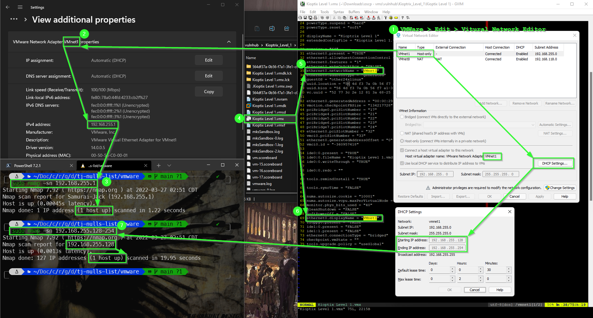

# Working with VMWare

> Author: David Boyd 
> Date: 2022-03-27

## Setup: WSL2 to VMWare Box

1. Check your VMWare's Virutal Network settings: `VMWare > Edit > Virtual
   Network Editor`
2. Get VMWare network adapter default gateway: `Settings > Network & internet >
   VMWare Network Adapter VMnet1 > View additional properties`
3. Confirm connectivity to adapter: `ping [default-gateway]`
4. Edit VM's config file (`.vmx`)
5. Replace `bridged` to your network adapter's name for `ethernet0.networkName`
6. Replace `bridged` to your network adapter's name for `ethernet0.displayName`
7. Discover VM's IP from adapter's IP range: 
  a. Boot VM from the `.vmx` file
  b. Get IP range: `VMWare > Edit > Virtual Network Editor > Host-only > DHCP
     Settings...` 
  c. Enumerate IP range and discover VM's IP: `sudo nmap -sn [ip.range]`

